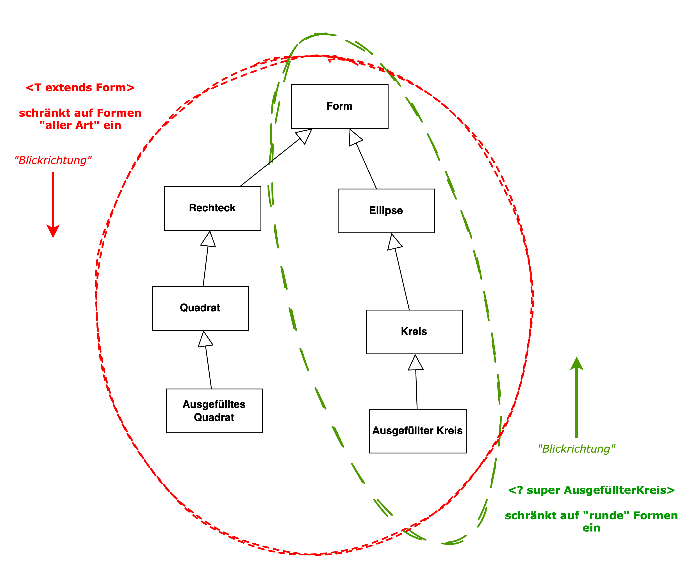

include::../../docs/settings.adoc[]
include::module-settings.adoc[]
:author: Thorsten Eckstein

// table of contents
:toc:

////
  Folgendes wird in "course-structure.adoc"
  aus jedem Modul zusammengeführt:

tag::content[]
----
1. Java Generics
1.1. Basics & Einführung
1.2. Bounded Generics
1.3. Wildcards
----
end::content[]
////

== Java Generics

*Generische Programmierung* in Java ist durch `Generics` seit langem möglich. Der Begriff steht synonym für "parametrisierte Typen". Die Idee ist, zusätzliche Variablen für Typen einzuführen. Diese Typ-Variablen repräsentieren zum Zeitpunkt der Implementierung unbekannte Typen. Dazu wird der sogenannte *Diamond-Operator* `<>` bei Klasse oder Methode genutzt:

[, java]
----
 List<T> list; <1>
 public Printer<T> { ...}
----
<1> `T` oft als Kürzel für `Type`

Erst bei der Verwendung der Klassen, Schnittstellen und Methoden im Code werden diese Typ-Variablen durch konkrete Typen durch den Entwickler ersetzt.

Damit kann generische und *typsichere Programmierung* gewährleistet werden. In der Regel wird die Codemenge durch Generics reduziert (Prinzip: `DRY` (_Don't Repeat Yourself_)), z.T. wird er allerdings dadurch auch schwerer wartbar und die Lesbarkeit nimmt ab. Die folgenden zwei Varianten finden sich in der Praxis am häufigsten:

* Java Generics bzgl. einer `Klasse`
* Java Generics bzgl. einer `Methode`

TIP: [small]#_Viele Beispiele finden sich, wie wir schon gesehen haben, im Collections Framework, etwa bei den Interfaces `List<T>` oder `Map<K,V>`. Siehe dazu z.B. -> https://docs.oracle.com/en/java/javase/17/docs/api/java.base/java/util/package-summary.html[Java 17 Package Documentation für `java.util`]!_#

[source,java,lines,title="Beispiel einer generischen Klasse"]
----
include::../src/main/java/de/dhbw/generics/demo/Joiner.java[tag="generic-class"]
----

Zeile 1 macht die Klasse generisch, in Zeile 9 wird der unbekannte Typ genutzt.

Die Nutzung einer generischen Klasse, z.B. in einem Test, sieht entsprechend so aus, indem der Typ `T` konkret angegeben wird:

[,java]
----
Joiner<String> joiner = new Joiner<String>();
// Typ kann bei der Initalisierung auch weggelassen werden
Joiner<String> joiner = new Joiner<>();
----

Auch Methoden können generisch sein, sie werden ähnlich wie Klassen definiert:

[source,java,title="Beispiel einer generischen Methode", indent=0]
----
include::../src/main/java/de/dhbw/generics/demo/Printer.java[tag="generic-method"]
----

Die Nutzung sieht dann so aus (z.B. wenn die Methode in einer Klasse `Printer` definiert ist):

[,java]
----
...
Document doc = Document.of("langer Text ...");
String printed = printer.print(doc);
----

=== Bounded Generics

Oft kommen sogenannte Begrenzungsausdrücke oder *bounded generics* zum Einsatz.

"Upper Bound"::

Dabei wird bei der Definition die Oberklasse angegeben, von welcher der *generische Typ erben muss*. Die Blickrichtung ist sozusagen _"nach unten"_.

Auf diese Weise wird der ansonsten _beliebige_ Typ eingeschränkt, sodass der generische Typ zwar immer noch unbekannt ist, aber nicht von _jedem_ Typ sein kann, sondern nur entsprechend der Einschränkung, z.B.

[, java]
----
 public <T extends Number> add(T first, T second) { ... }
----

Hier kann z.B. der genutzte Datentyp ausschließlich ein Zahlen-Datentyp sein, der von `Number` erbt.

Auch die *gegenteilige Blickrichtung* _"nach oben"_ kann auch angegeben werden:

"Lower Bound"::

Der Begrenzungsausdruck

[, java]
----
<? super FilledCircle>
----

bedeutet, dass der Typ hier ein Supertyp von `FilledCircle` sein muss, also FilledCircle selbst oder eine Oberklasse von dieser.

Es definiert eine untere Grenze für den erlaubten Typ. Dazu ein Beispiel:

[, java]
----
public void draw(List<? super FilledCircle> list)
----

`List<? super FilledCircle>` ist hier die Angabe dafür, das die "draw" Methode die   Liste mit bestimmten Typen "zeichnen" kann, nämlich deren Elemente "kreisförmig" sind.

Der Unterschied lässt sich grafisch besser verstehen:

.Grafische Erläuterung der Wildcard-Logik

=== Wildcards

Im Rahmen der Generics kann man anstelle der Typvariable - oben z.B. `T` - durchaus auch die sogenannte *Wildcard* `?` nutzen. Das schafft Flexibilität hinsichtlich der spezifizierbaren Typen (erschwert aber die Nutzung der Typvariable selbst innerhalb der Klasse, weil `?` für "irgendwas" steht).

=== Demonstrationen

Die Unit-Tests zur *Demonstration* finden sich hier:

[subs="normal"]
 {mod-ref-test}/generics/GenericsDemoTests.java

Der zugehörige, in den Tests genutzte *Quellcode* findet sich hier:

[subs="normal"]
 {mod-ref-src}/generics/demo/*.java

=== Übungen

Nutze folgendes Package für die *Unit-Tests*:

[subs="normal"]
 {mod-ref-test}/generics/GenericsExerciseTests.java

Die im Test benutzten *Implementierungen* gehören in das Package:

[subs="normal"]
 {mod-ref-src}/exercises/*.java

TIP: Zahlentypen in Java haben eine gemeinsame Superklasse `java.lang.Number`.

[[generics-exercise-1]]
*Übung 1*:: Ein *Interface*

Erstelle ein *Interface* für einen Taschenrechner, der die vier Grundrechenarten in Form von Methoden zur Verfügung stellt, also für ...

* addieren,
* subtrahieren,
* multiplizieren und
* dividieren.

Der Taschenrechner sollte mit beliebigen Zahlen-Datentypen umgehen können.

[[generics-exercise-2]]
*Übung 2*:: Eine *Klasse*

Realisiere einen generischen, aber *konkreten* Taschenrechner für die 4 Grundrechenarten, der alle Zahlen-Datentypen verarbeiten kann. Schreibe dazu hier einen kleinen Test, der die Funktionsfähigkeit mindestens einer der Rechenarten mit Beispielwerten testet, aber mit unterschiedlichen Zahlen-Datentypen.

[[generics-exercise-3]]
*Übung 3*::

Implementiere eine konkrete Klasse `Workflow`.

Diese Klasse soll eine statische, generische Methode `execute` bekommen, die beliebige Workflow-`Schritte` ausführen kann.

Die Workflow-Schritte sollen von einer Eltern-Klasse namens `Step` erben. Implementiere mindestens 2 konkrete Workflow-Schritte.

Realisiere für die "Ausführung" der `execute` Methode einfach eine Konsolenausgabe, z.B. des Names des konkreten Workflow-Schrittes (d.h. der Klassenname).

////
Übungsfragen::
In der nachstehenden Testklasse finden sich kleine "Quizfragen" für die Inhalte des Kurses 3:

[subs=attributes]
 {course-3-exam}/ExamTest.java
////

=== Tipps, Patterns & Best Practices

* Bei Listen sollte man immer mittels Diamond-Operator `<>` den Datentyp für die Liste angeben